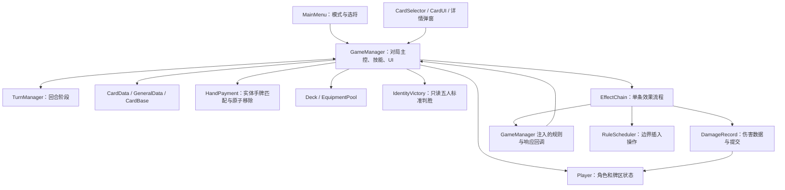
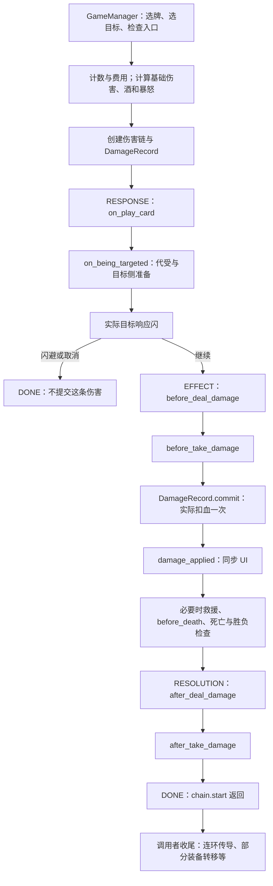

# 项目架构设计：当前实现与结算时序

更新：2026-09-12。原架构记录依据 [GameManager](../../Scripts/GameManager.gd)、[EffectChain](../../Scripts/EffectChain.gd)、[DamageRecord](../../Scripts/DamageRecord.gd)、[RuleScheduler](../../Scripts/RuleScheduler.gd)、[TurnManager](../../Scripts/TurnManager.gd) 与 [Player](../../Scripts/Player.gd) 的静态阅读；现补充 PR #7 已合入的 [IdentityVictory](../../Scripts/IdentityVictory.gd)、[HandPayment](../../Scripts/HandPayment.gd)、普通救援后的终局重查和青龙回合记录。专项测试尚未全部纳入 CI。

本文说明代码现在怎样工作，并单列尚未完成的设计。规则依据仍为[原始手册](../Original/校园杀完全知识手册.md)与[确认记录](规则确认与待讨论.md)；代码行为不自动成为裁定。开发顺序见[里程碑计划](里程碑计划.md)，当前任务见[看板 #5](https://github.com/i-iillusion/xiaoyuansha/issues/5)。

## 1. 群里两种说法怎样对应

“响应阶段 → 效果阶段 → 结算阶段”描述的是 **EffectChain 对一次效果的三个程序分组**；“指定目标 → 成为目标 → 响应 → 将造成伤害 → 将受到伤害 → 实际扣血 → 濒死／死亡 → 伤害后技能”描述的是 **规则时机及实际操作的先后顺序**。两者粒度不同，可以对应，但不能理解为所有卡牌都严格经过同样的三个完整阶段。

尤其注意：代码名 `RESOLUTION` 在这里主要指伤害后的触发，不包含全部中文语境下的“结算”。濒死／死亡已经在前一个 `EFFECT` 分组的回调里处理完；决斗响应、出牌费用、多目标遍历以及连环传导还有链外的调用者逻辑。

| 层级 | 回答的问题 | 当前代码 |
| --- | --- | --- |
| 回合阶段 | 轮到谁，处于判定/摸牌/出牌等哪个阶段？ | TurnManager 的 START、JUDGE、DRAW、PLAY、DISCARD、END、WAITING |
| 效果链阶段 | 这一条效果处理到哪里？ | EffectChain 的 RESPONSE、EFFECT、RESOLUTION、DONE |
| 规则触发点 | 现在允许检查什么技能或替代效果？ | `on_being_targeted`、`before_deal_damage` 等事件与 GameManager 回调 |
| 单独规则调度 | 在某个边界先插入哪个高优先级操作？ | RuleScheduler 的待执行队列和上下文帧 |

这四者不是四套相互替代的回合系统。当前使用 Godot 的信号、Callable 和 `await` 串接它们，没有完整的通用规则解释器。

## 2. 模块与职责现状

| 模块 | 当前承担什么 | 已知边界 |
| --- | --- | --- |
| MainMenu / Scenes | 模式入口、选将、场景及基础布局 | 只开放 1V1、五人测试模式，其他入口有占位 |
| GameManager | 组建对局、费用、目标、规则分支、武将技能、AI 默认处理、弹窗、日志、倒计时 | 约 7,200 行，规则与 UI 耦合；不能把图中的回调当作已拆出的独立技能模块 |
| TurnManager | 阶段推进、使用次数、跳阶段、赠送阶段索引、等待信息及按座位记录的每回合首次杀 | 不是支持任意嵌套回合的完整上下文栈；额外回合与完整赠送阶段仍待统一 |
| Player | 手牌/装备/判定区、身份、技能状态、体力/死亡、距离及开局快照 | 开局复原依赖显式登记字段，新增状态不能自动完整恢复 |
| CardBase / CardData / GeneralData | 具体牌资源、牌类型/描述、武将数据 | 部分技能逻辑仍按武将名分支；空白手牌以 `null` 表示，具体牌入口仍有缺口 |
| HandPayment | 从物理手牌中按声明或响应类型选择并原子移除原实例；任意牌在支付时具体化 | 不处理目标合法性、技能弃牌费用、响应窗口或牌的最终去向；`determined_cards` 尚未统一接入 |
| Deck / EquipmentPool | 弃牌记录、装备唯一性占用 | Deck 不是传统有限抽牌堆；牌实例转移与销毁仍需审计 |
| EffectChain / DamageRecord | 单条伤害的阶段、回调、来源/目标与一次性扣血 | 不负责整个多人事件的统一事务、存档或回放 |
| RuleScheduler | 在 checkpoint 处按优先级执行 Callable，保存当前上下文引用和阶段字符串 | 是调度机制；不是已经实现预大习等完整技能 |
| IdentityVictory | 按五人标准身份配比、生命状态和剩余身份给出胜方；无 UI、奖惩和状态写入 | 有濒死者则等待；非法配置、全员同时死亡、1V1 和奸雄不套用本模块；尚未执行回归 |

## 3. 一次普通杀：从选牌到后续处理

这里以正常的单目标杀为例，先不展开贯石斧、多目标或连环分支。

效果修正阶段也可能因为免伤、替代或伤害不大于零而取消，图中省略了这些通向 DONE 的分支。`DONE` 只表示这条链结束，不表示整张牌的所有目标、派生效果或整局游戏已经结束。

### 3.1 规则词语与具体函数的映射

| 规则描述 | 当前所在位置 | 代码现在做什么 |
| --- | --- | --- |
| 声明/指定目标 | 链外的 `play_card`、`execute_card_on_target`、目标查询与 `_execute_single_strike` | 准备牌、目标、计数、费用和伤害初值；`on_play_card` 也是链的起始扩展点，但当前回调没有独立处理这一事件的技能分支 |
| 成为目标 | RESPONSE / `on_being_targeted` | 杀的舍己为人可改写实际目标；随后 `_prepare_strike_target` 检查目标并处理部分装备交互 |
| 响应 | RESPONSE / `_on_chain_response_check` | 实际目标是否出闪；它不是通用“任何响应牌”处理器，决斗/无懈等在别处 |
| 将造成伤害 | EFFECT / `before_deal_damage` | 来源侧一次性修正；例如寒冰剑替代、丈八费用和增伤、古锭刀、灾厄剑 |
| 将受到伤害 | EFFECT / `before_take_damage` | 实际目标的拍胸脯、防具修正和命运之刃等，决定是否免伤或替代 |
| 实际扣血 | EFFECT / `DamageRecord.commit()` | 记录扣血前后体力、已提交伤害量，调用 `Player.take_damage` |
| 濒死／死亡 | EFFECT / `damage_applied` 回调内部 | 先同步血条，必要时等待救援和死亡前 checkpoint，再确认死亡 |
| 造成伤害后 | RESOLUTION / `after_deal_damage` | 来源仍可行动时，按 GameManager 当前分支顺序处理破风枪、勾镰爪、噬血、摄魂、凯文等 |
| 受到伤害后 | RESOLUTION / `after_take_damage` | 目标仍可行动时处理荆棘、凯文等 |
| 链外收尾 | `_finish_damage_chain` 和调用者 | 连环传导、灾厄袍/劣马转移等；灾厄剑转移等还在外层调用中 |

“指定目标”并没有一个同名的独立 `on_target_declared` 事件。当前雌雄双股剑等“指定目标后”的效果放在 `_prepare_strike_target`，由成为目标的回调调用。文档中的规则用语因此不能机械等同于现有函数名；后续若拆出更细事件，应维持已确认时序。

### 3.2 舍己为人：为什么代受者还能闪

A 对 B 使用杀，C 发动舍己为人。当前链保留 `original_target = B`，将 `target = C`，并记录已询问过代受，避免同一条杀反复收取代受费用。EffectChain 会对改变后的目标继续执行“成为目标”回调，然后由 C 响应闪。

若 C 成功出闪，这条伤害不提交，B 和 C 都不因此扣血。若 C 未闪，后续防具检查读取 C 的状态，不能沿用 B 的白银狮子等修正。目标遍历使用 `visited` 防止同一目标被无限重复处理；这只是现有循环防护，不是多人连续代受规则已经全部定义。

### 3.3 丈八：为什么不能先扣基础伤害再补扣

丈八在命中后的 `before_deal_damage` 询问来源支付失血，增加本次完整伤害数值，然后才进入实际目标的防具处理和一次 `commit()`。例如基础 1、丈八增加 2：白银狮子对完整的 3 点封顶为 1；没有先扣 1 再追扣 2 的第二次提交。

若来源支付丈八失血后进入濒死，代码在这里先处理其救援/死亡。只有来源完成死亡后，DamageRecord 才把当前 `source` 清为 `null`，同时保留 `original_source` 用于追溯。已经发起的后续伤害仍可按无来源继续；濒死本身不等同于失去来源。

## 4. 并非所有效果都走同样的入口

| 路径 | 当前调用方式 | 与普通杀的差别 |
| --- | --- | --- |
| 普通杀 | `_execute_single_strike` → `_new_damage_chain` → `start` → 收尾 | 注入出闪回调，正常经过目标与响应过程 |
| 普通直接伤害 | `_deal_damage` → 同一伤害链 | `skip_targeting = true`，整个 RESPONSE 的目标/响应处理直接跳过；非杀、非传导的代受目前在 `before_deal_damage` 处理 |
| 决斗 | `_play_duel` 先处理合法性、无懈及交替出杀，再调用 `_deal_damage` | 决斗响应不是 EffectChain 内的“出闪阶段”，不能为它再自动补一轮闪 |
| AOE/延时锦囊 | GameManager 的卡牌专用流程处理响应/判定，伤害调用共用链 | 牌的整体流程、目标列表和判定仍未统一进入通用卡牌效果对象 |
| 方天多目标杀 | 一次声明/付费，逐目标调用单目标杀 | 多条伤害链，不是一个伤害记录同时指向多个目标；前面结算可能改变后续目标状态 |
| 铁索连环 | 初始链返回后在 `_finish_damage_chain` 发起传导 | 每个传导目标新建链，标记 `is_chain`；先解除本次连环，跳过重复代受及源侧修正，仍有目标侧处理 |
| 贯石斧 | 闪避后由外层付坐骑费用，创建强制命中的新链 | 不重启已结束的原链；保留原目标追溯，跳过重复指定/响应/代受 |
| 回复 | 多处直接调用 `Player.heal`；EffectChain 也有 HEAL 分支 | HEAL 枚举存在不代表所有回复都已接入统一链；目前没有完整回复前/后事件体系 |
| 失去体力 | 例如丈八、烈火盾、是啊费用直接减少 `hp`，由相应调用者处理濒死 | 不应触发普通伤害防具和伤害后技能；尚无完整独立的体力变化服务 |
| 扣除体力等特殊规则 | 手册有定义，复杂武将尚未完整接入 | 不可把直接改 hp 的现状宣称为已完整支持所有强制扣血与拦截语义 |

因此，群里的“所有效果都分了三阶段”可作为设计方向理解，但对当前代码而言，准确说法是“共用伤害链具备三个阶段；很多上层卡牌和特殊效果仍有专用流程”。

## 5. 伤害记录保护了什么

| 字段/保护 | 作用 | 限制 |
| --- | --- | --- |
| `original_source` / `source` | 原始来源与当前有效来源分开；已死亡来源可清空 | 保存的是运行时 Player 引用，不是持久化回放 ID |
| `original_target` / `target` | 原目标与实际承受者分开 | 换目标需在对应阶段做，并重新核对目标侧逻辑 |
| `amount` / `applied_amount`、`hp_before` / `hp_after` | 将待提交数值与实际提交记录分开 | 日志/后续技能仍有读取链当前数值的路径，不能随意在扣血后重写 amount 并认为历史随之改变 |
| `committed` | 同一记录不重复扣血 | 不保护错误创建的第二条独立伤害记录 |
| `EffectChain._started` | 同一链不重复启动 | 不是并发调用的完成等待接口；重复调用不会重走第一次 start |
| 来源/目标修正标志 | 每条链避免重复叠加同侧修正 | 不能据此假定所有技能组合都已覆盖 |
| `from_strike` / `is_chain` / `sacrifice_offered` | 区分杀、传导和是否已询问代受 | 是当前特定规则的标记，未来新效果仍需明确语义 |
| `events` | 记录经过的触发点，供断言检查时序 | 不是完整游戏日志、撤销记录或事件溯源系统 |

Player 将状态区分为 ACTIVE、DYING、DEAD。当前 `is_alive()` 兼容旧代码，实际表示 ACTIVE；判断是否完成死亡应使用 `is_dead()`，判断救援窗口使用 `is_dying()`。已有调用点仍需按语义审计，见里程碑 ST-15。

## 6. 暂停与恢复有三种含义

### 6.1 弹窗等待：await 保留调用位置

`await` 等待弹窗信号或异步函数完成后，从原调用点继续；它没有冻结整个 Godot 场景树，也没有保存磁盘快照。其他 `_process`、倒计时或输入仍可能执行，所以 UI 状态清理与防重复触发仍是 GameManager 的职责。

### 6.2 TurnManager.WAITING：记录正在等谁响应

杀的响应入口调用 `start_waiting` 记录响应者和类型；`end_waiting()` 当前直接切回 PLAY，没有保存任意原阶段的通用栈。它与 EffectChain.RESPONSE 不是同一个枚举。它也不能被视为已解决额外回合、赠送阶段、多人嵌套响应的完整恢复系统；这正是 ST-17/24/25 需要核查的边界。

### 6.3 RuleScheduler：在明确边界插入单独规则

每次 `_trigger` 的事件回调前、后都会执行 checkpoint，后置阶段名为 `事件名:after`。普通伤害、丈八/烈火盾/是啊失血统一进入 `_resolve_dying`，在现有救援返回后仍濒死时执行 `before_death` checkpoint。

调度器从待处理队列中选择最高优先级条目，将上下文引用、阶段名和规则名压入 `_frames`，等待该 Callable 完成，随后弹出帧，继续原调用。优先级相同按入队顺序选择；只有到达 checkpoint 才检查，不会抢占一个正在执行的回调。`before_death` 现传入 DyingContext，其 `effect_chain` 保留原链（链外为 null）；其他链事件仍传 EffectChain。这样丈八失血的濒死者与其原链伤害目标不会混淆。

这个机制可以在边界暂停普通链、修改上下文、取消后续效果，然后恢复。它没有实现原子事务、失败回滚、任意时刻抢占或跨进程恢复。2026-09-12 已有预大习相关案例最终裁定，但接口存在不等于完整实现；当前规则和开发门槛见 [QA-007](QA.md) 与[开发前检查](首版开发前检查-2026-09-12.md)。

## 7. 死亡、伤害后技能与终局的当前先后

普通伤害扣血后，`damage_applied` 先更新 UI；目标濒死时等待 `_resolve_dying`。该入口登记 DyingContext，依次执行 `_check_dying`（全体普通求救/装傻/贤者）→ 仍濒死才进 `before_death` → 仍濒死才 `_handle_death` → 释放窗口 → 重查终局；三个失血入口共用此流程。最终死亡处理依次确认死亡并登记防重入、公开非空身份、清理牌区、执行击杀奖惩、检查胜负；活跃窗口非提交阶段不能直接进入死亡。**完整预大习尚未接入：成功保留三个牌区，失败才进入最终死亡处理。** QA-T07～T09 的入口回归不等于完整技能验收。

普通求救由 `_run_rescue_round` 按当前回合起算的轮转快照依次询问；同一人可连续支付，放弃/无牌则下一人，救回立即结束。`_rescue_options` 和 `_use_rescue_card` 为自救、玩家救他人和 AI 共用的规则/支付入口；`_ask_rescue_card` 只负责测试替身、AI 意愿或人类弹窗。出桃者与治疗目标分别传给权杖处理；酒仅自救。弹窗使用独立的一次性答复对象，不复用伤害响应信号，但尚未实现全局 UI 暂停栈。规则依据及未上线特殊救援见 QA-T09。

随后 EffectChain 才进入伤害后事件。GameManager 对来源侧和目标侧伤害后分支分别检查是否仍可行动，所以目标死亡后不会照常发动它的普通受伤后技能；反伤等又可能生成嵌套伤害链。连环传播则在初始链的伤害后事件完成、`start()` 返回之后进入。

这说明“濒死／死亡在伤害后技能之前”已体现在普通伤害路径中，但“所有多人效果全部结算完后才统一判胜”并未实现。2026-09-08 起，死亡处理调用 IdentityVictory：不再由凶手身份决定胜方，也不在内奸尚存时因反贼全灭提前结束。名单中有 DYING 或仍存在活跃 DyingContext 时暂不判胜；即使父规则已临时救回角色，也等所有窗口返回后重查。部分外层目标循环看到 `_game_over` 后停止的现有行为未改动。窗口内原有击杀奖惩仍正常执行，暂缓的是终局提交。

历史修补未实现预大习、奸雄声明或特殊多人死亡事务，也未更改现有奖惩与普通伤害后事件顺序。QA-T05 的实现和待验证记录见[五人局验收](规则差异与五人局验收.md)；当前 QA-007 登记案例已获最终裁定，下一步是实现/验证，不再等待同一批规则讨论。

## 8. 后续设计方向与阅读入口

以下为建议，尚未全部实现：先把胜负、合法性/费用等无 UI 逻辑小步抽离，再统一玩家/AI 的响应接口和上下文，最后扩展技能标签、动态技能、额外回合、单位与空间。暂不把 GameManager 一次性重写成全新规则引擎。

| 后续方向 | 对应短期目标/里程碑 | 必须保留的约束 |
| --- | --- | --- |
| 牌实例、声明、费用、移动的一致入口 | ST-08～13、ST-26 | 已具体化不重新声明；取消不丢牌；费用与效果分开 |
| 胜负和死亡窗口明确化 | ST-04～07、ST-15 | 濒死不等于死亡；来源身份不代替存活身份条件 |
| 玩家与 AI 共用响应决策接口 | ST-19～25 | 相同合法性、费用、次数；等待/取消必须回到正确上下文 |
| 小模块拆分及状态快照 | ST-16、ST-32、M4 | 保持当前已确认顺序，新增状态显式登记 |
| 单独规则、额外回合、空间效果 | M5/M6，QA-003/004/005/007 | 先有完整事件案例，再实现；不能用队列顺序代替裁定 |

讨论具体问题时，建议给出“角色/牌区/身份初值 → 入口 → 当前事件名 → 费用 → 实际目标/来源 → 预期结果”，同时注明是在描述现有行为还是请求修改规则。

已有 [test_rule_settlement.gd](../../Test/test_rule_settlement.gd) 包含代受后响应、丈八/防具一次修正、负体力、来源死亡、暂停恢复和死亡先于伤害后技能等断言；[test_confirmed_rules.gd](../../Test/test_confirmed_rules.gd) 覆盖部分已确认卡牌规则。它们是定位行为的材料，不代表所有武将和所有链路已经验证；未获用户要求时不手动执行测试。
